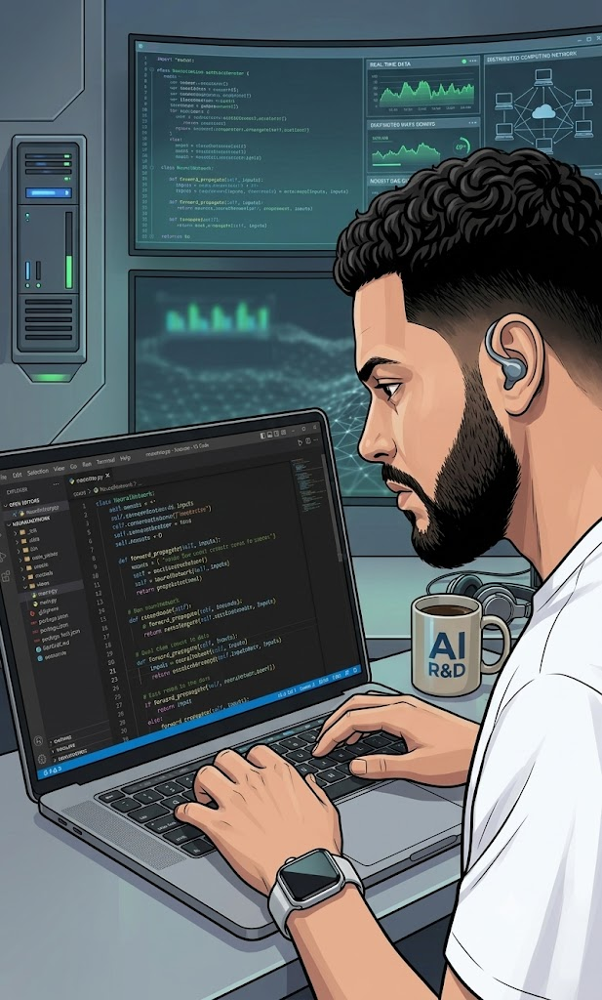

<h1 align="center">patrick@dev:~$ portfólio</h1>

<p align="center">
  Portfólio pessoal de <b>Patrick Santos Ribeiro</b>, Desenvolvedor Full Stack com foco em IA aplicada.<br />
  Estética de terminal, dark mode e conteúdo real: experiência, projetos para clientes e projetos open source.
</p>

<p align="center">
  <a href="https://patricksantosribeiro.vercel.app"><b>🌐 Ver o site no ar</b></a>
</p>

<p align="center">
  
</p>

<p align="center">
  
  
  
  
  
  
</p>

---

## Seções

| Seção | O que mostra |
| :--- | :--- |
| `home` | Apresentação, texto digitado, download do currículo e contato |
| `sobre_mim()` | Resumo profissional e stack por área |
| `experiencia()` | Trajetória em formato de histórico de commits |
| `formacao()` | Graduações, pós, cursos e idiomas |
| `projetos()` | Projetos para clientes, com galeria de telas, e projetos open source |
| `servicos()` | O que a Selintech entrega |
| `contato()` | E-mail, WhatsApp, LinkedIn e GitHub |

## Destaques do projeto

- **Conteúdo separado da interface:** experiências, projetos, stack e formação ficam em `src/data/`. Para atualizar o site, basta editar esses arquivos.
- **Tema centralizado** em `src/theme/theme.ts` com styled-components.
- **Responsivo** e com `prefers-reduced-motion` respeitado nas animações dos cards.
- **SEO e compartilhamento:** metatags Open Graph e Twitter com imagem de prévia, canonical e `theme-color`.

## Estrutura

```
src/
├── assets/          # foto e capturas dos projetos
├── components/      # uma pasta por seção (index.tsx + style.tsx)
├── data/            # conteúdo do site: experiences, projects, skills, education
├── styles/          # estilos globais e cabeçalho de seção
├── theme/           # cores e fontes
└── utils/           # mapa de ícones das tecnologias
public/
├── og-image.jpg     # imagem de prévia para redes sociais
└── curriculo-patrick-santos-ribeiro.pdf
```

## Como rodar

```bash
npm install
npm run dev      # ambiente de desenvolvimento
npm run build    # build de produção (tsc + vite)
npm run preview  # testa o build localmente
```

## Contato

[LinkedIn](https://www.linkedin.com/in/patrick-santos-162899207/) · [GitHub](https://github.com/PatrickSantos-htk) · patricksantosribeiro2017@gmail.com
